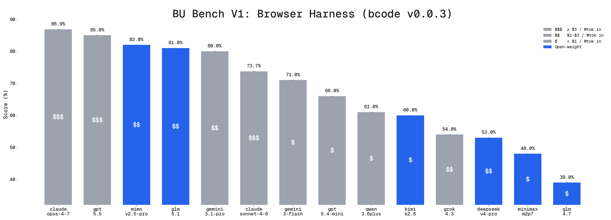

# The browser-native agent.

<br/>

A streamlined coding agent that drives real browsers through unconstrained CDP.

The unbounded power of the browser working seamlessly with your code. The agent adapts to every site at runtime and writes scripts to reuse later.

<!-- DEMO VIDEO HERE -->

## One-Line Install

Run this in a terminal that supports bash:

```sh
curl -fsSL https://bcode.sh/install | bash
```

## Usage

Open the TUI:

```sh
bcode
```

Run an agent headlessly:

```sh
bcode run "On Google flights return all flight details from New York to SF tomorrow"
```

### Connect an LLM

<picture>
  <source media="(prefers-color-scheme: light)" srcset="static/browser_harness_by_model_light.png">
  <source media="(prefers-color-scheme: dark)" srcset="static/browser_harness_by_model_dark.png">
  
</picture>

BrowserCode supports any model you can reach with an API key, plus [every provider OpenCode supports](https://opencode.ai/docs/providers).

Use `/connect` in the TUI, or set provider API keys in your environment.

Recommended models from current BrowserCode evals:

- Frontier: `claude-opus-4-7`, `gpt-5.5`
- Value: `glm-5.1`, `mimo-v2.5-pro`
- Budget: `gemini-3-flash-preview`

### Connect a Browser

**Let the agent connect for you.** It knows how. 

You can prompt:

```text
Connect to my current tab on amazon.com and find deals for 64GB DDR5 RAM, return URLs
```

The agent will take control of your actual browser.

```text
Make a new browser profile and QA test http://localhost:3000, fix bugs and open a PR
```

The agent will work locally in its own browser profile.

```text
Open a remote browser and extract every item sold on mcdonalds.com in SF
```

The agent will control a Browser Use Cloud browser and give you a link to watch it.

#### Cloud Browsers

- Browser Use Cloud offers unlimited free browsers, limited to 3 concurrent sessions, with stealth, captcha solving, and proxies.
- Just set `BROWSER_USE_API_KEY` in your environment. The agent can sign up completely autonomously; just ask it to. To upgrade further, go to [cloud.browser-use.com](https://cloud.browser-use.com).

## Philosophy: do more with less

Browser ability and code-writing ability are deeply connected.

We turned browser interaction into a coding problem; the agent writes JavaScript that drives Chrome directly through CDP. Minimal abstractions. Maximal power to the agent. 

*BrowserCode outperforms every browser agent we have tested it against.*

## Architecture

BrowserCode is a fork of [OpenCode](https://github.com/anomalyco/opencode) with a vendored TypeScript port of [Browser Harness](https://github.com/browser-use/browser-harness).

It adds one core browser primitive:

```text
browser_execute(code)
  -> runs JavaScript in-process
  -> talks to Chrome through the DevTools Protocol
  -> keeps the browser session alive across calls
  -> returns logs, values, and screenshots to the agent
```

Reusable browser scripts are written to:

```text
.bcode/agent-workspace/
```

*BrowserCode is not built by the OpenCode team and is not affiliated with OpenCode in any way.*

## Telemetry

BrowserCode sends anonymous usage traces to help improve the project. To opt out, set `DO_NOT_TRACK=1` in your environment.

## Contributing

Most upstream contributions belong in one of the projects BrowserCode builds on:

- Browser automation: [browser-use/browser-harness](https://github.com/browser-use/browser-harness)
- Core coding-agent: [anomalyco/opencode](https://github.com/anomalyco/opencode)

Run from source:

```sh
git clone https://github.com/browser-use/browsercode.git
cd browsercode
bun install
bun run --cwd packages/opencode dev
```

<hr>


